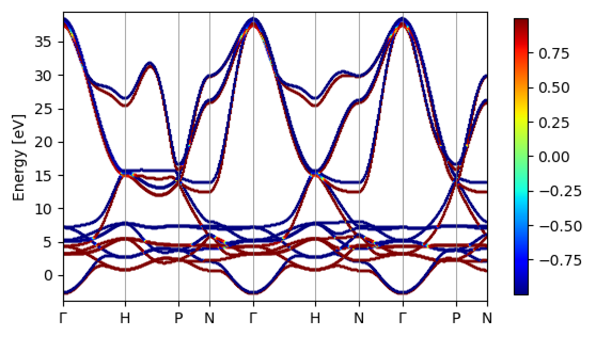

# Iron – Spin-orbit-coupled bands and Fermi-surface contours
A simple example using the interface.
See Wannier90's `example17` for more details.

## Run
__NOTE__: `ISYM=-1` is recommended for SOC calculations.
1. Generate PBE `POTCAR` file. [PAW_PBE Fe]
2. Run VASP in `1-scf` to get `WAVECAR` and `CHGCAR` files.
3. Run VASP in `2-band` to get bandstructure. Inspect which bands do we want to wannierize.
4. Copy `WAVECAR` and `CHGCAR` to `3-wannier_gen` and VASP  to get `.mmn`, `.amn`, `.spn` file.
5. Run wannier90.x in `3-wannier_gen` to get `wannier90.chk` file.
6. Un-comment the following in `wannier90.win` in `3-wannier_gen`:
```
kpath = true
kpath_task = bands
kpath_bands_colour = spin
kpath_num_points=500
!restart = wannierise
!bands_plot = true
!bands_num_points = 1000
!bands_plot_format = gnuplot
begin kpoint_path
G 0.0000 0.0000 0.0000   H 0.500 -0.5000 -0.5000
H 0.500 -0.5000 -0.5000  P 0.7500 0.2500 -0.2500
P 0.7500 0.2500 -0.2500  N 0.5000 0.0000 -0.5000
N 0.5000 0.0000 -0.5000  G 0.0000 0.0000 0.000
G 0.0000 0.0000 0.000    H 0.5 0.5 0.5
H 0.5 0.5 0.5            N 0.5 0.0 0.0
N 0.5 0.0 0.0            G 0.0 0.0 0.0
G 0.0 0.0 0.0            P 0.75 0.25 -0.25
P 0.75 0.25 -0.25        N 0.5 0.0 0.0
end kpoint_path
```
Then, run postw90.x in `3-wannier_gen` to get bandstructure plot with spin expectations.


<!--  -->

7. Undo what we just did in set 6, then, un-comment the following in `wannier90.win` in `2-wannier_gen`:
```
kslice = true
kslice_task = fermi_lines
kslice_fermi_lines_colour = spin
fermi_energy = 5.4020
kslice_2dkmesh = 200 200
kslice_corner = 0.0  0.0  0.0
kslice_b1 =     0.5 -0.5 -0.5
kslice_b2 =     0.5  0.5  0.5
```
Then, re-run postw90.x in `3-wannier_gen` to get fermi slice plot with spin expectations.


<!--  -->

## More ideas
- Inspect spin decomposed bandstructure, do you see the SOC-induced avoided band crossing?
- Change spin quantization axis, then re-run `wannier90.x`. Check the shape of the 1st Wannier function.
- Change k-points density and/or total number of bands, do you see any difference in the final plot? Can you make sense of it?
