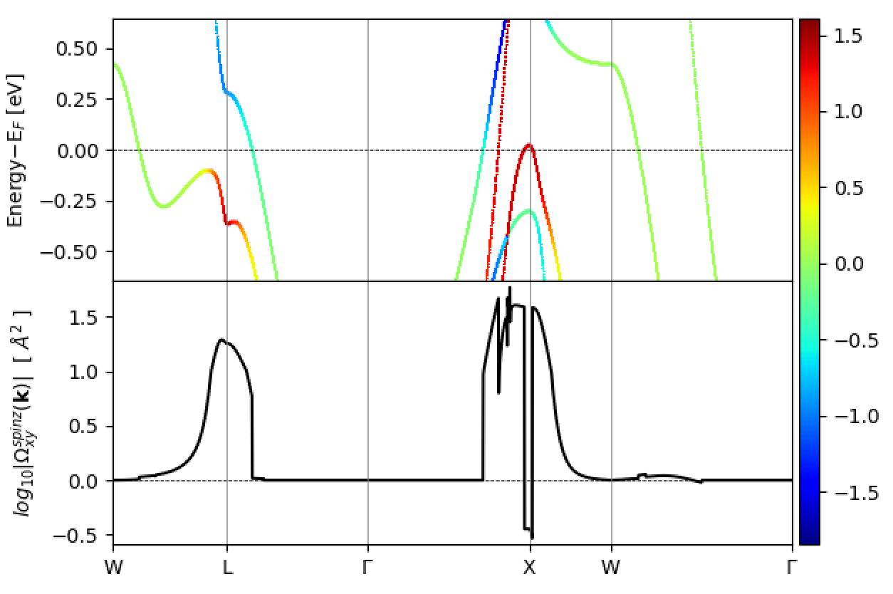
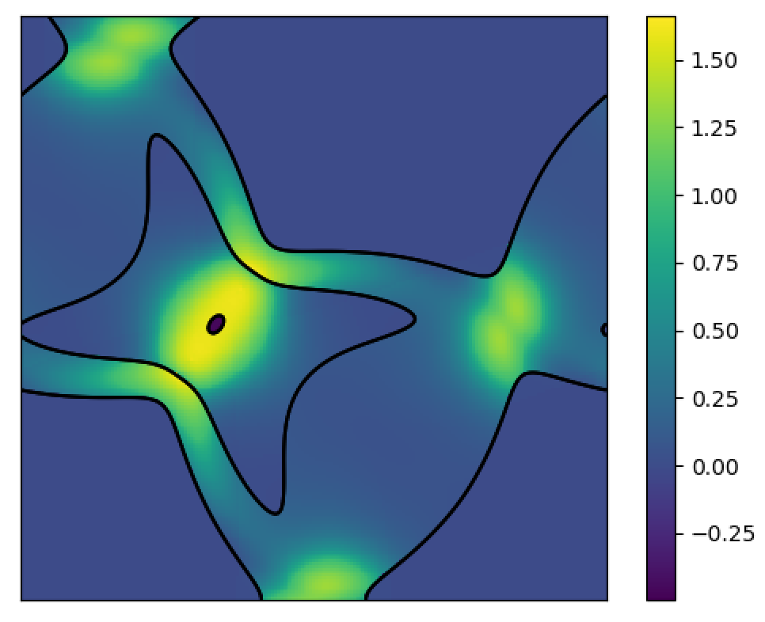
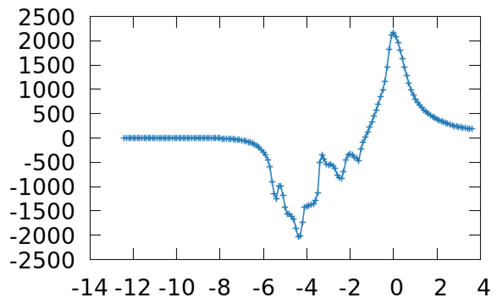
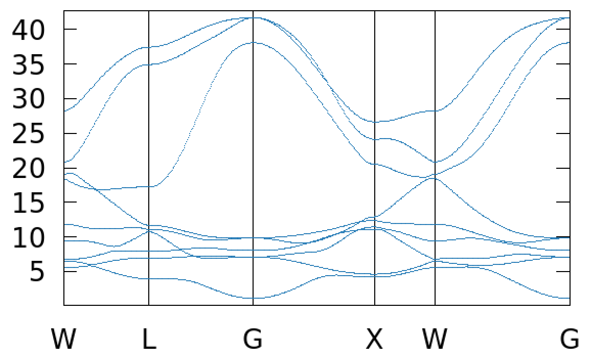

# Platinum – Spin Hall conductivity
A simple example using the interface.
See Wannier90's `example29` for more details.

## Run
__NOTE__: `ISYM=-1` is recommended for SOC calculations.
1. Generate PBE `POTCAR` file.
2. Run VASP in `1-scf` to get `WAVECAR` and `CHGCAR` files.
3. Copy `WAVECAR` and `CHGCAR` to `2-wannier_gen` and VASP  to get `.mmn`, `.amn`, `.spn` file.
4. Run wannier90.x in `2-wannier_gen` to get `wannier90.chk` file.

5. Un-comment the following in `wannier90.win` in `2-wannier_gen`:
```
kpath = true
kpath_task = bands+shc
kpath_bands_colour = shc
kpath_num_points = 400
kubo_adpt_smr = false
kubo_smr_fixed_en_width = 1
fermi_energy = 11.4028
berry_curv_unit = ang2
begin kpoint_path
W  0.75  0.50  0.25    L  0.50  0.00  0.00
L  0.50  0.00  0.00    G  0.00  0.00  0.00
G  0.00  0.00  0.00    X  0.50  0.50  0.00
X  0.50  0.50  0.00    W  0.75  0.50  0.25
W  0.75  0.50  0.25    G  0.00  0.00  0.00
end kpoint_path
```
Then, run postw90.x in `2-wannier_gen` to get k-resolve SHC in a band structure plot.


<!--  -->


6. Undo what we just did in set 5, then, un-comment the following in `wannier90.win` in `2-wannier_gen`:
```
kslice = true
kslice_task = shc+fermi_lines
kslice_corner = 0.0 0.0 0.0
kslice_b1 = 1.0 0.0 0.0
kslice_b2 = 0.3535533905932738 1.0606601717798214 0.00
kslice_2dkmesh = 200 200
```
Then, re-run postw90.x in `2-wannier_gen` to get k-resolve SHC plotted in a fermi slice.


<!--  -->


7. Undo what we just did in set 6, then, un-comment the following in `wannier90.win` in `2-wannier_gen`:
```
berry = true
berry_task = shc
!fermi_energy = 11.4028
berry_kmesh = 25 25 25
berry_curv_adpt_kmesh = 5
berry_curv_adpt_kmesh_thresh = 100
fermi_energy_min = -1
fermi_energy_max = 15
fermi_energy_step = 0.1
```
Then, re-run postw90.x in `2-wannier_gen` to get fermi sweeping plot of SHC.


<!--  -->

8. Undo what we just did in set 7, then, un-comment the following in `wannier90.win` in `2-wannier_gen`:
```
bands_plot = true
bands_num_points = 100
bands_plot_format = gnuplot
begin kpoint_path
W  0.75  0.50  0.25    L  0.50  0.00  0.00
L  0.50  0.00  0.00    G  0.00  0.00  0.00
G  0.00  0.00  0.00    X  0.50  0.50  0.00
X  0.50  0.50  0.00    W  0.75  0.50  0.25
W  0.75  0.50  0.25    G  0.00  0.00  0.00
end kpoint_path
```
Then, re-run postw90.x in `2-wannier_gen` to get Wannier interpolated band structure.


<!--  -->

## More ideas
- Inspect spin decomposed bandstructure, do you see the SOC-induced avoided band crossing?
- Change spin quantization axis, then re-run `wannier90.x`. Check the shape of the 1st Wannier function.
- Change k-points density and/or total number of bands, do you see any difference in the final plot? Can you make sense of it?
